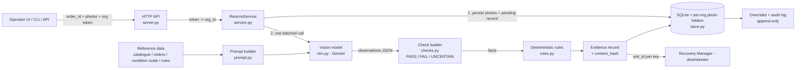

# Architecture

## 1. Overview



The design separates **seeing** from **deciding**:

| Layer | Responsibility | Deterministic? |
|---|---|---|
| Vision model (`vlm.py`, `prompt.py`) | Report what is visible: product, parts, state, damage, proposed grade — each with image-cited evidence | No |
| Check builder (`checks.py`) | Validate evidence, apply confidence thresholds, produce `PASS`/`FAIL`/`UNCERTAIN` | Yes |
| Rules (`rules.py`, `reference/disposition_rules.json`) | Map verdicts + grade + catalogue flags to a disposition | Yes |
| Service (`service.py`) | Orchestration, fail-open, overrides, retries | Yes |
| Store (`store.py`) | Tenant-isolated persistence, append-only audit | Yes |

The model never picks the disposition. So the same observations always produce the same disposition, and every disposition can be explained by a rule id.

## 2. Data flow for one inspection

1. **Auth.** `Authorization: Bearer <token>` → `org_id`. There is no parameter for choosing an org, so a caller cannot ask for another org's data.
2. **Order lookup (org-scoped).** `get_order(org_id, order_id)`; another org's order → 404.
3. **Input validation.** 1–8 photos, ≤15 MB each, type detected from the file bytes (JPEG/PNG/WebP). The browser downscales to 1600 px before upload.
4. **Persist first (fail open).** Photos go to `var/images/<org_id>/<random 128-bit id>.jpg` with their SHA-256. A record is written with `status: pending`, and a `captured` audit event is logged.
5. **One model call.** The prompt contains the ordered product card, its look-alikes, the exact parts list, the quoted condition scale, and the instructions to cite `image_index` and to prefer `UNCERTAIN`. The response is constrained by a JSON `responseSchema` (grades are an enum of the published scale). Temperature is 0.
6. **Checks.** See §4.
7. **Rules.** See §5.
8. **Record.** Built per §6, hashed, stored. A `decided` audit event is logged.
9. **Human review.** Overrides are appended, the effective disposition is updated, and the agent's `checks`/`outcome` are left untouched.

If step 5 fails (timeout, quota, network, invalid JSON, blocked response), the record is still stored. All checks become `UNCERTAIN`, rule `R01_MODEL_UNAVAILABLE` gives `pending_review`, and a `model_failed` audit event is logged. `POST /retry` re-runs the model from the stored photos.

## 3. AI model usage

| Aspect | Choice | Why |
|---|---|---|
| Model | Gemini Flash family (`GEMINI_MODEL`, fallbacks via `GEMINI_FALLBACK_MODELS`) | Multimodal, fast, low cost per return |
| Calls per return | **1** (identity + parts + state + damage + grade in one request) | Engineering rule 2: batch related reasoning; latency and cost scale with returns volume |
| Output | Schema-constrained JSON; falls back to schema-less JSON if a model rejects the schema | Parseable, auditable |
| Temperature | 0 | Reduce run-to-run variance |
| Retries | 1 retry on 5xx/network errors; then the next fallback model on 404/429/403; then fail open | Availability without losing the case |
| Transport | REST via Python standard library | No SDK or dependencies; easy to run on any laptop |
| Operator note | Passed as "unverified" context | It may be wrong; it never overrides visual evidence |
| Latency / cost | `latency_ms` on every check; `usageMetadata` token counts in `metrics.usage` | Reported in the evaluation |

Swapping the provider only needs a new `Provider.inspect()` in `vlm.py`. `OfflineProvider` (no model) and `ScriptedProvider` (tests, cached eval replays) already use that interface.

## 4. From observations to verdicts (`checks.py`)

"No invented evidence" is enforced in code, not only in the prompt:

- Evidence must cite an existing **and usable** `image_index` with a non-empty observation. Anything else is dropped, and the count of dropped items is written into `detail`.
- A `MATCH`/`MISMATCH`/`PRESENT`/`ABSENT` claim with **no remaining evidence**, or below its confidence threshold, becomes `UNCERTAIN` / `NOT_VISIBLE`.
- An expected part the model did not report is `NOT_VISIBLE`. It is never assumed present.
- `ABSENT` is only allowed when the photos show the full contents or the place the part belongs. Otherwise the model must say `NOT_VISIBLE`.
- If the model says `MATCH` while naming a different catalogue SKU as the best match, that contradiction makes identity `UNCERTAIN`.
- A grade that is not on the published scale is rejected, and condition becomes `UNCERTAIN`.

| Check | PASS | FAIL | UNCERTAIN |
|---|---|---|---|
| `image_quality` | ≥1 usable photo | — | no usable photo |
| `identity` | MATCH, conf ≥ 0.75, evidence | MISMATCH (incl. look-alike / empty box), conf ≥ 0.75, evidence | otherwise |
| `completeness` | every expected part PRESENT | ≥1 part ABSENT (conf ≥ 0.7, evidence) | no part ABSENT but ≥1 NOT_VISIBLE |
| `condition` | grade on the scale, conf ≥ 0.65, evidence | grade = Unacceptable | otherwise |

Thresholds live in `reference/disposition_rules.json`.

## 5. Disposition rules (`rules.py`)

These are evaluated in order, and the first match wins. The rule id and its text are copied into the record, together with the list of rules evaluated.

| # | Rule | Disposition |
|---|---|---|
| R01 | model failed | pending_review |
| R02 | no usable photo | pending_review |
| R03 | identity FAIL (wrong item / empty box) | pending_review — possible return abuse, never restocked under the ordered SKU |
| R04 | identity UNCERTAIN | pending_review |
| R05 | condition UNCERTAIN | pending_review |
| R06 | Unacceptable + severe damage | dispose |
| R07 | Unacceptable (e.g. needs repair) | liquidate |
| R08 | hygiene-sensitive SKU showing use | dispose |
| R09 | completeness UNCERTAIN | pending_review |
| R09B | parts confirmed missing **and** others unseen, and the unseen ones would change the outcome | pending_review |
| R10 | a non-replaceable part missing | liquidate |
| R11 | ≥2 parts missing | liquidate |
| R12 | 1 replaceable part missing, grade ≥ Used - Good | refurbish |
| R13 | 1 replaceable part missing, Used - Acceptable | liquidate |
| R14 | complete + New | restock |
| R15 | complete + Used - Like New | restock (as Like New) |
| R16 | complete + Very Good / Good | refurbish (clean / repackage, relist at grade) |
| R17 | complete + Acceptable | liquidate |
| R99 | fallback | pending_review |

The brief's worked example (headphones, USB cable missing, Used - Good) resolves to **R12 → REFURBISH**, and this is covered by a unit test.

## 6. Evidence record (contract)

This follows the organiser's evidence-contract fields. A full illustrative example is in `docs/sample_evidence_record.json`.

```jsonc
{
  "record_id": "RTN-9001-3FA1C2",          // RTN-<unit>-<random>
  "schema_version": "rtn-evidence-1.0",
  "organization_id": "org_demo_alpha",      // tenant
  "client_id": "seller_alpha_01",
  "agent": {"name": "returns-manager", "version": "0.1.0", "provider": "gemini",
            "model_version": "gemini-3.5-flash", "rules_version": "rules-2026-09-28",
            "condition_scale": "amazon-condition-guidelines"},
  "subject": {"stage": "customer_return", "unit_id": "UNIT-9001", "order_id": "...",
              "sku": "...", "asin": "...", "expected_parts": ["..."]},
  "captured_at": "...Z", "decided_at": "...Z",
  "operator_label": "op_jay",
  "images": [{"image_id": "<128-bit random>", "index": 0, "sha256": "...", "mime": "image/jpeg", "uri": "/api/images/..."}],
  "checks": [{"check_key": "identity", "verdict": "PASS", "confidence": 0.93, "detail": "...",
              "evidence": [{"image_index": 0, "observation": "..."}], "value": {...},
              "model_version": "...", "latency_ms": 2140}, ...],
  "model_observations": {...},              // raw model JSON, kept for audit
  "outcome": {"disposition": "refurbish", "rule_id": "R12_MISSING_ONE_REPLACEABLE", "rule_text": "...",
              "rules_version": "...", "needs_human_review": false, "rules_evaluated": [...], "summary": "..."},
  "effective": {"disposition": "liquidate", "source": "override", "override_id": "OVR-..."},
  "overrides": [{"override_id": "...", "field": "disposition", "original_value": "refurbish",
                 "revised_value": "liquidate", "reason": "...", "operator_label": "...", "created_at": "..."}],
  "status": "pending | decided | review | overridden",
  "errors": [], "attempts": 1,
  "metrics": {"model_latency_ms": 2140, "total_latency_ms": 2300, "usage": {...}},
  "content_hash": "sha256:..."
}
```

For the **Recovery Manager**, `unit_id` is the join key across the five stages. `effective.disposition` is the operational outcome. `outcome` plus `checks` show what the agent concluded, and `overrides` show where a human disagreed.

**What `content_hash` means:** it is the SHA-256 of the canonical JSON of the record, excluding `content_hash`, `overrides`, `status` and `effective`. It lets anyone check that the agent-authored part has not changed since the decision (`GET /verify`). It is **not** tamper-proof: someone with database write access can recompute it. There is no signing and no external anchoring.

## 7. Tenancy isolation

- Every table has `org_id`, and every query includes `WHERE org_id = ?`. No code path reads by id alone.
- The org comes only from the bearer token, never from a request parameter.
- Photo ids are random 128-bit values (`secrets.token_hex(16)`), stored under `images/<org_id>/`. They are served only through `/api/images/{id}`, which checks the owning org and verifies the resolved path lies inside that org's folder. Another org's record or photo returns **404** (not 403), so its existence is not revealed.
- Tests: `TestTenancy` covers the store level and the real HTTP API (org bravo sees zero rows, and gets 404 on alpha's record and photo URLs).

## 8. Overrides and audit

- `overrides` and `audit_log` tables are insert-only. No code path updates or deletes them.
- An override needs a reviewer name and a reason (at least 5 characters) and records the original value.
- Overriding a check verdict or grade records the human's view **without** rewriting the agent's check. The disposition override changes `effective.disposition` only.
- Audit events: `captured`, `model_failed`, `decided`, `retry_requested`, `override`.

## 9. Evaluation design

See `eval/README.md` and `returns_agent/evaluation.py`:

- 50+ held-out units photographed under varied conditions, covering the ten brief scenarios.
- Two people label them independently. We report percent agreement and Cohen's kappa per field.
- Ground truth is the value both labellers agree on. Disputed cases are excluded from accuracy but reported, including the agent's UNCERTAIN rate on them.
- Per check we report accuracy (all cases and decided-only), FP/FN with "positive = problem found", UNCERTAIN/review rate, confusion matrices, latency p50/p95 and tokens.
- Raw model outputs are cached by image hash in `eval/results/cache/`, so the report can be regenerated without re-calling the model.

## 10. Known risks and next steps

- Barcode/label OCR as a second identity signal (it would reduce look-alike UNCERTAIN cases).
- Tune the thresholds from the eval's confidence-vs-correctness curve rather than fixed values.
- Real authentication and roles (operator vs supervisor), plus encryption at rest for photos.
- Signed records (for example HMAC or an append-only log) if tamper evidence is required.
